# *Abdulrahman's Notebook*
## *2026-01-27 Project Decided*
We had a brainstorming session with the group today. We had a few ideas like the air quality sensor, smart map, smart shower, but we landed on the smart white cane. I'd been pushing for fall detection because of my prior research in inertial classification, and the cane attachment was a clean way to fold it in. We haven't chosen a name for our project yet.

## *2026-01-29 Proposal Submitted*
I submitted our project proposal in time for the early extra-credit approval. General project scope / elements we'd like to include are BLE, ESP32, tactile inputs, USB charging, high range battery, motor haptics, TOF, IMU, smartphone app, fall detection. The IMU/fall-detection firmware and the motor/buzzer/button output circuits will be what I will work on most with the app and the rest of the components left to Eraad and arsalan.

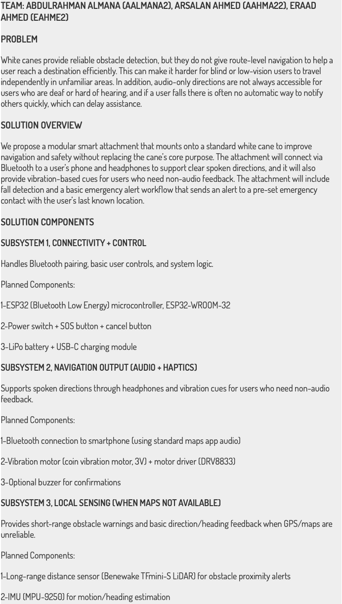
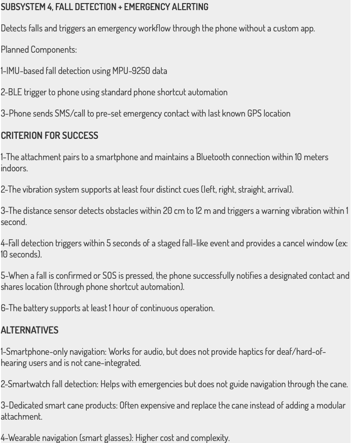

## *2026-02-06 Allocation of Responsibilities*
Roles split. Eraad runs PCB layout and power (best solderer of the three of us). Arsalan handles ESP32 wiring, I2C, and most of the firmware for the Android app. I will be working on the output circuits (vibration, sound, button input), in both firmware and hardware, plus the fall-detection state machine.

## *2026-02-17 Design and Practicality Discussion*
We settled on attachment over a full replacement cane. This will lower the work on machine shop and users will get to keep their familiar cane, and it will be used as a fallback if the electronics fail, the users can simply go back to their original cane.
For my work: the TOF (VL53L4CX) needs to sit parallel to the ground at the natural cane angle so it looks forward at torso height, I made a brief sketch of our desugered seign and sent it to the machine shop so that they know what we expect. IMU is the ICM-20948, which has relatively good accelerometer precision for fall detection. We will also have two coin vibration motors instead of one so we can bias left/right, which means two independent low-side switches in the driver.

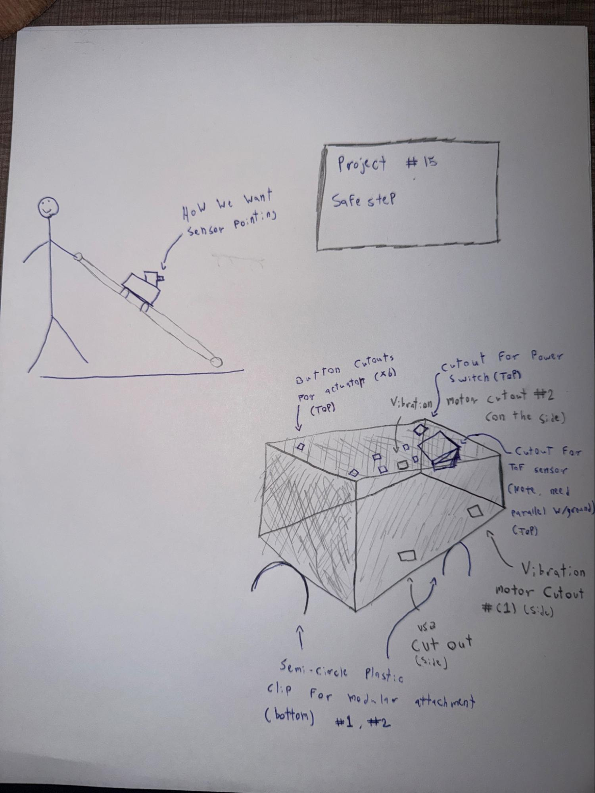

## *2026-02-25 Researching Parts*
We spent most of our time this week speccing the output circuits.
Motor switch: IRLML0030TRPBF in SOT-23. 30 V VDS, 5.3 A drain, Vgs(th) 1.7 V, a 3.3 V GPIO fully saturates it. Adding a 150 Ω gate resistor (limits gate-charge current to 22 mA, damps ringing) and a 10 kΩ pull-down so the motor doesn't twitch on boot. BAT54SLT1G Schottky for flyback; 0.1 µF Vbat decoupling per channel.
Buzzer (CEM-1203(42)): 35 mA rated draw is too close to the ESP32's 40 mA per-pin limit, plus inductive back-EMF. So GPIO drives a 2N3904 in common-emitter:
IC = (3.3 - 0.3) / 42 = 71 mA IB(min) at hFE = 100, so 0.71 mA With 180 Ω base resistor, so IB = 14.4 mA, so we get 20x saturation overdrive
This is good enough of a margin. CLD diode on the collector for transient clamping.

## *2026-03-04 Design Review and Changes*
This week we spent time on the design review. Some of the feedback we got from the professor and the TAs was to tighten the scope, fix presentation structure, introduce our selves before starting, revisit battery and regulator situation. After the presentation, Eraad decided to go the LiPo and TPB4056A redesign. Putting TOF and IMU on separate buses so that there is no address contention, and there is independent reset/debug. 

## *2026-03-13 Breadboard Demo and Progress*
This was the week of the initial breadboard demo. We wrote the first draft of the fall-detection state machine: NORMAL → FREEFALL → IMPACT → FALLEN. Dropped the breadboard from shoulder height onto a padded surface, buzzer fired first try. But shaking hard could also push it into FREEFALL, which is something we need to look into. A proposed fix by Arsalan is possibly bumping freefall confirmation to 20 consecutive samples (200 ms) before transitioning. So then a strong shake can dip below threshold for a few samples but not for 200 ms straight.

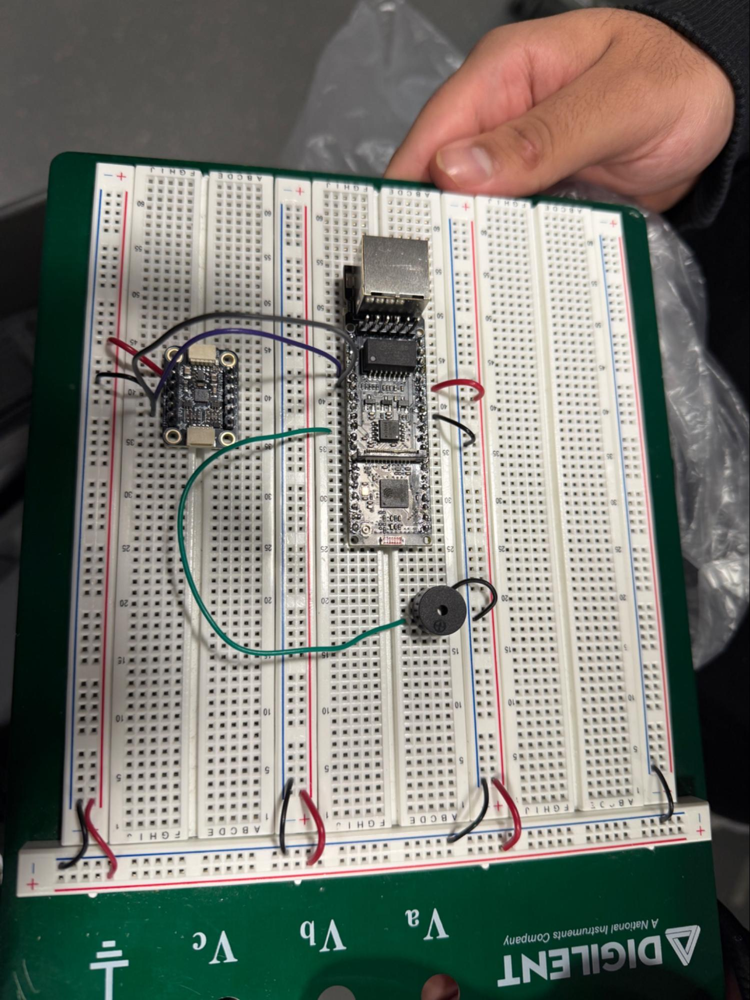

## *2026-03-28 Fourth Round PCB Submission*
V2 Gerbers out. The blocks I designed made it in clean: two IRLML0030 stages (gate resistors, pull-downs, flybacks, decouplers), the 2N3904 buzzer stage (180 Ω base, CLD diode), and four button circuits (10 kΩ active-low pull-ups). We have test points on every block, TP3/TP13 for motor PWM, buzz TP on the BJT collector, TP15-17 and TP22 for buttons, so that we can probe without touching ESP32 pads.
Buttons are active-low on purpose: matches the ESP32's internal pull-up direction, and holding the unpressed line at 3.3 V is apparently better for noise than holding it near GND. 10 kΩ limits press current to 330 µA.

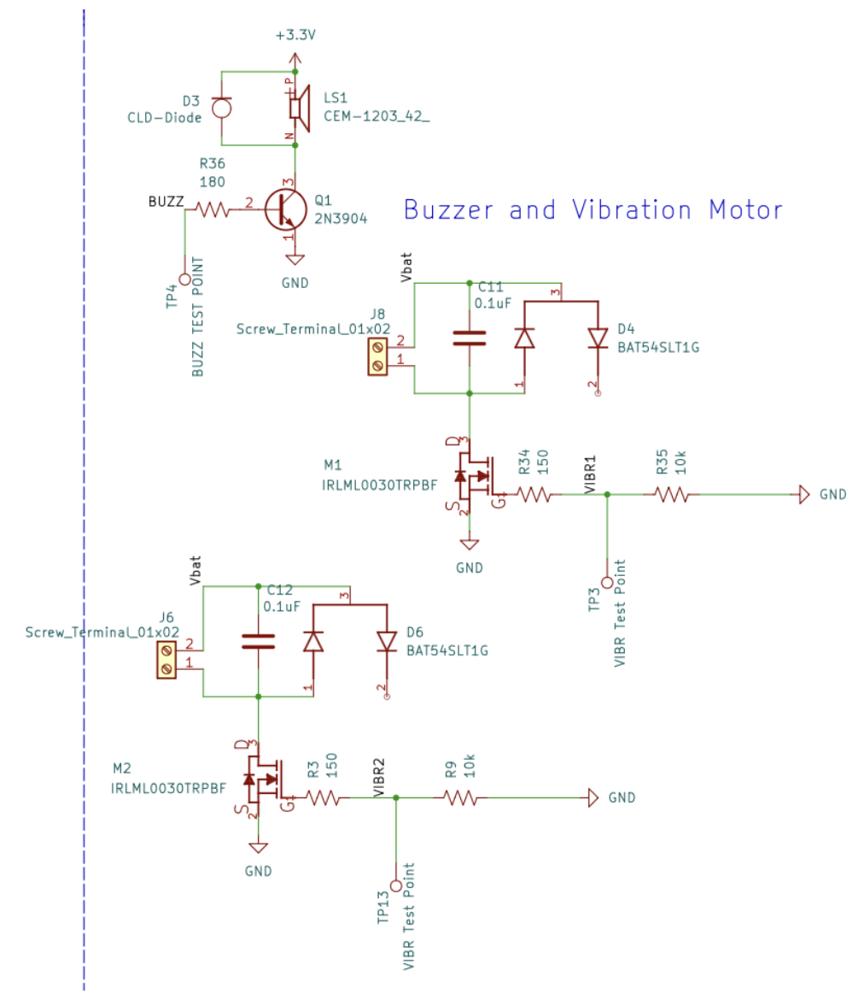
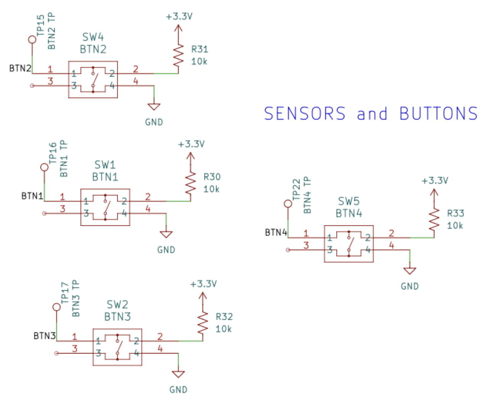

## *2026-04-01 Individual Progress Report and 2nd Breadboard Demo*
This week I submitted my IPR, IMU fall detection, TOF zone classifier, and the PCB blocks.
For the second breadboard demo we had to show significant progress. So we received and full set up the Time of Flight (ToF) sensor on our breadboard, and we created three proximity zones (CLOSE/MEDIUM/FAR) to motor PWM duty, where if object is close, it will buzz the motors at full power, if the object is medium distance it will buzz for 60% of power, and if the object is far, it will buzz at about 30% of power (All numbers are temporary for demo purposes). We also
Drop tested the breadboard on my hoodie in the floor with 20-samples:
10/10 reached FALLEN, Normal-motion peaks: 8.2-14.6 m/s² (n=20), Drop peaks: 30-60 m/s² 
This gives us good amount of headroom over the 25 m/s² impact threshold. We also want to start assembling the 3rd rounf PCB.

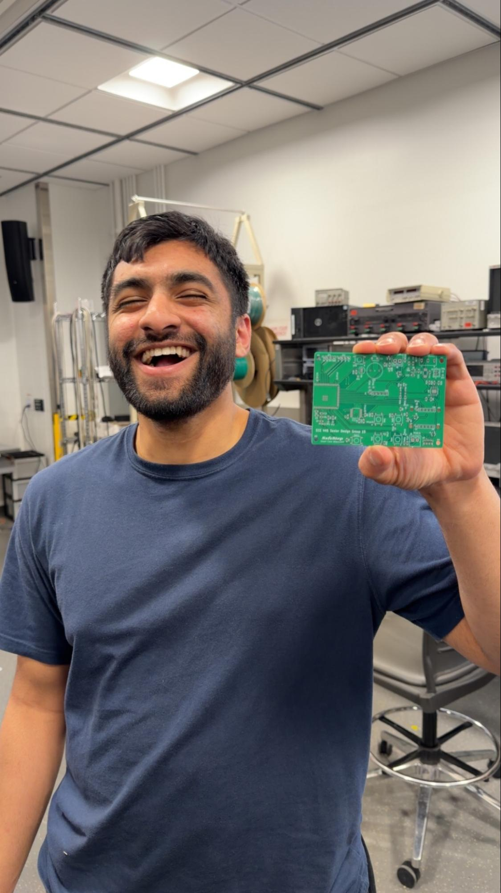
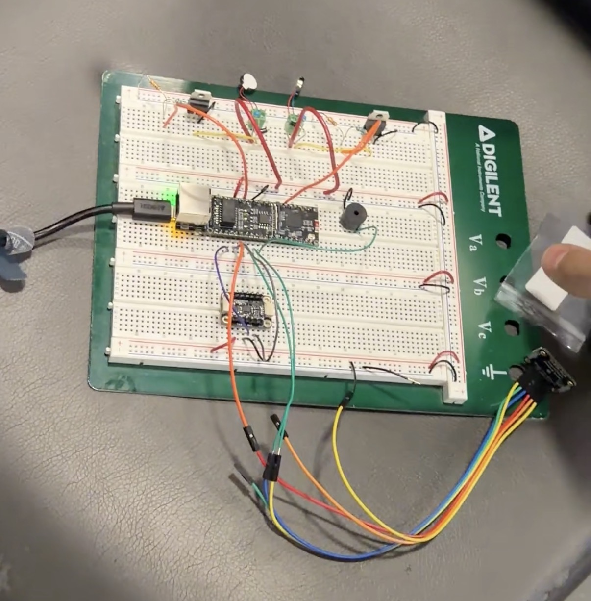

## *2026-04-07 2nd Progress Demo and V1 PCB Assembly*
This week we showed the breadboard system to the professor and the TA. He liked our progress but stressed that we don't have much time to get everything soldered on the pcb and working by the end of April. We also assembled the V1 PCB, but it won't flash. This issue is likely due to missing D+/D- differential routing and the missing crystal on the MCP-2200. V2 of the PCB drops the bridge IC entirely for the ESP32-S3's native USB.

## *2026-04-15 Final PCB Assembly and Machine Shop*
After the changes Eraad made, PCB V2 flashes. As soon as we confirmed that it flashed, we Brought the board and came to the machine shop for the housing and TOF mount.
Verification on my blocks: motor PWM at TP3/TP13 clean at 0/80/135/255 duty, MOSFET drain on PWM off-edge stayed under Vbat + 0.5 V (flybacks), buzzer at the BJT collector held 2 kHz, all four buttons read 3.3 V open / 0 V pressed.
After getting the PCB enclosure, we need to go back and re-adjust the fall detection thresholds. Drop peaks are way higher than the breadboard ever showed. We got 100+ m/s². So 25 m/s² impact is too permissive; pushing it to 80 m/s² makes the impact stage much more selective without losing real falls.
We also raised the freefall threshold to 5.0 m/s² and dropped the sample count to 10, but added a noise-tolerance counter that only resets the freefall counter after 4+ consecutive above-threshold samples. A single mid-freefall IMU spike was removing valid detection windows otherwise.

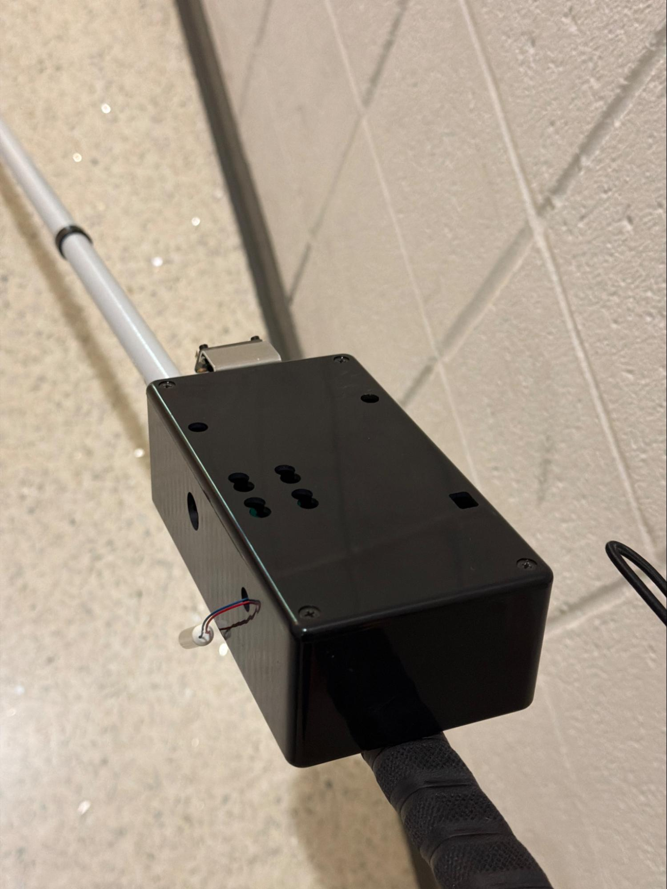
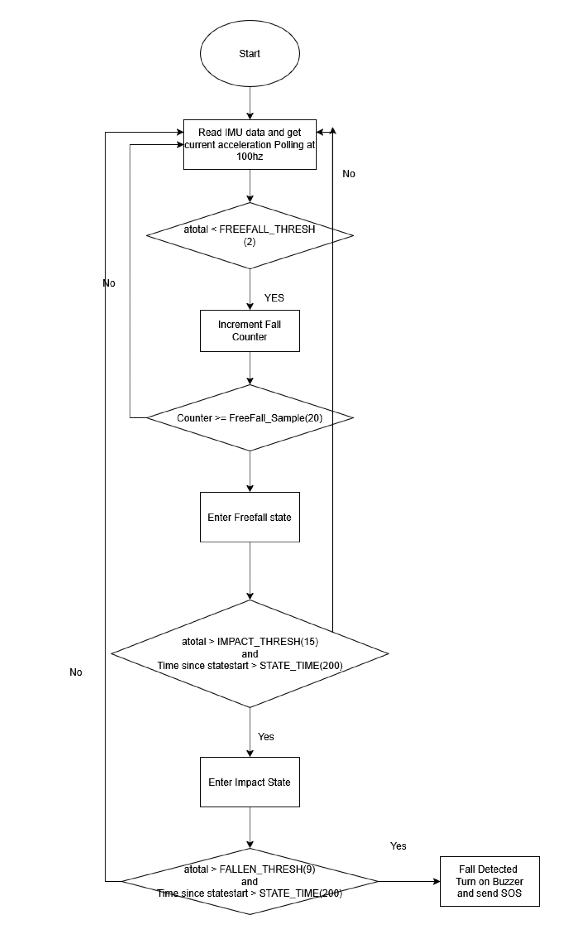

## *2026-04-21 Mock Demo and Work Left*
We had to make some adjustments to the machine shop box as, for the buttons, the only cut circular holes with a drill and gave us one plunger for all the buttons, which is not usable by a blind person. We'll 3D print individual plungers this week.
The mock demo showed PCB live fall detection with cancel button, TOF haptic feedback, and modular button input. What is left is end-to-end SMS via BLE pipeline, longer motor leads so they sit in the grip.

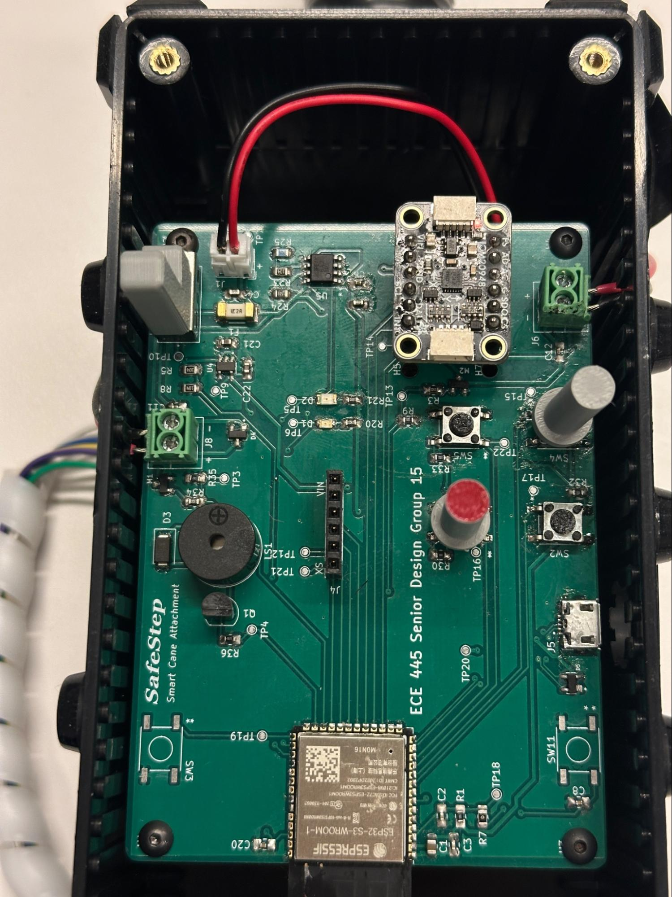

## *2026-04-30 Final Demo and Final Presentation*
Final demo and presentation done. Both went well.
Fall detection landed at 18/20 (90%). The two misses were gradual stumble-style falls with no clean freefall phase below 5.0 m/s², this is exactly the failure mode we flagged early, and a known limitation of freefall-based IMU classifiers. Disappointing not to hit 95%, but it's an honest, well-understood failure. TOF mean error stayed under 1.5%. SMS dispatch was 10/10.
Things we'd do differently: hardware debouncing on the buttons, a wider drop dataset including stumbles before locking thresholds, gyro features for the gradual-fall case, and IMU/TOF directly on the PCB instead of dangling off breakout boards.

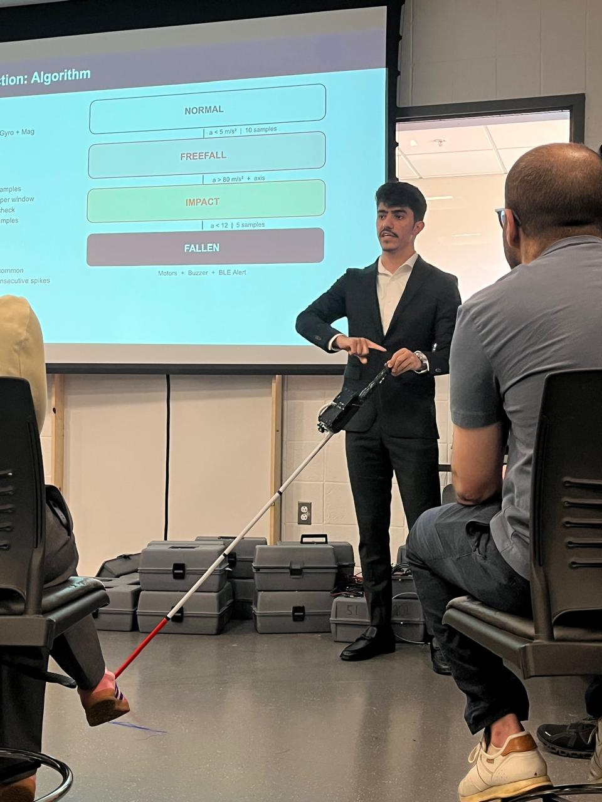

## *2026-05-07 Last Week for 445*
We were included in the ECE445 hall of fame by Honorable mention. I am proud of what we put together. Big thanks to Eraad, Arsalan, and our TA Abdullah.
