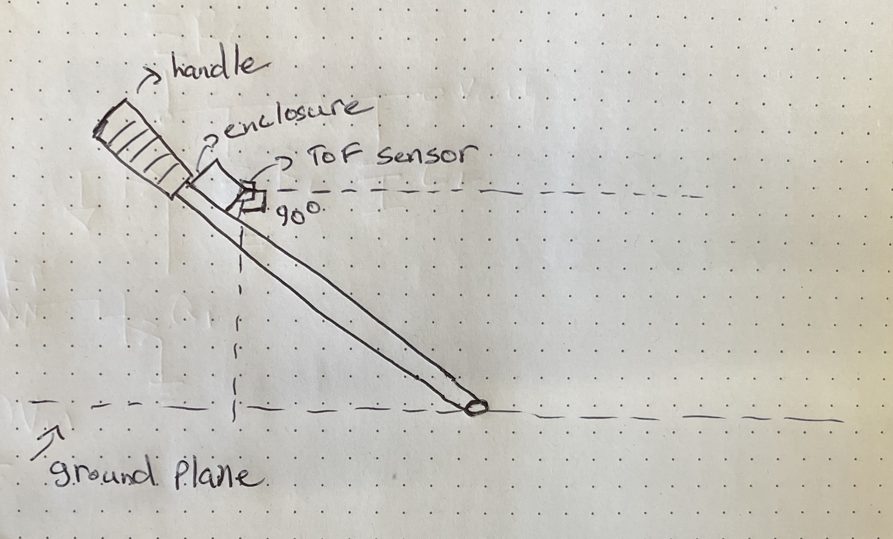
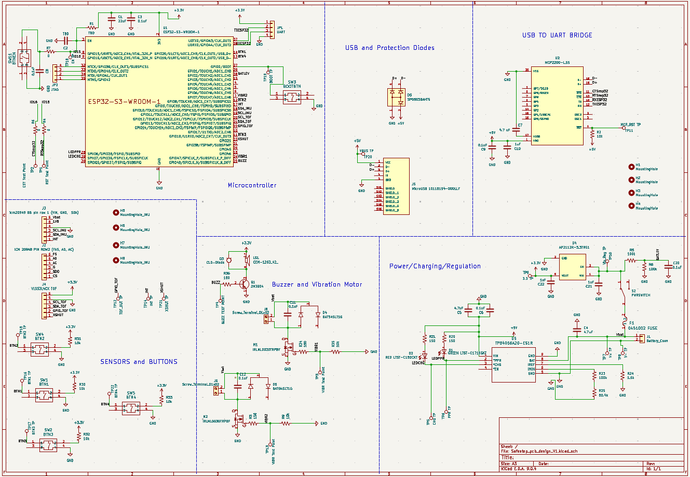
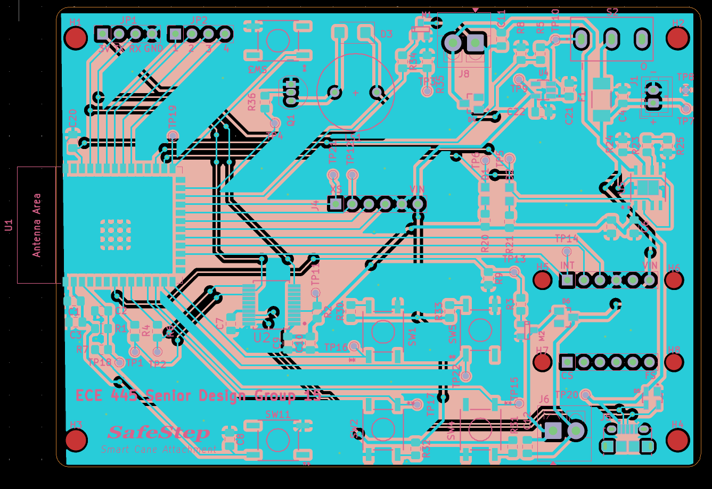
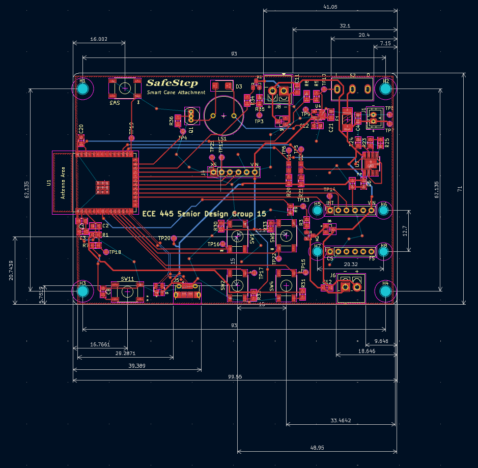
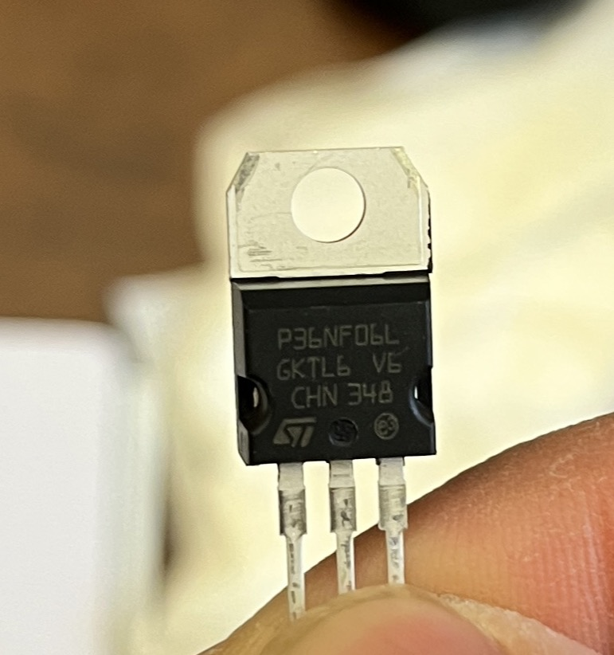
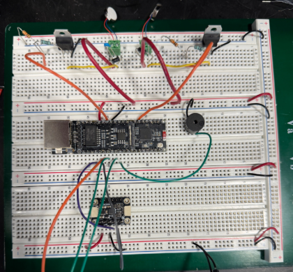
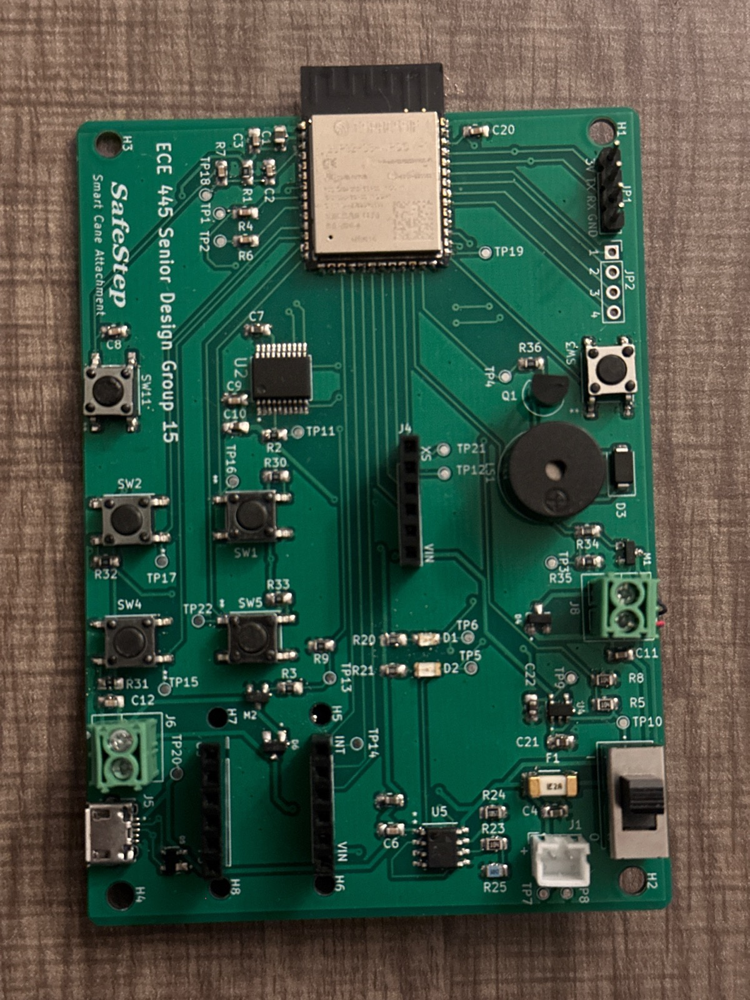
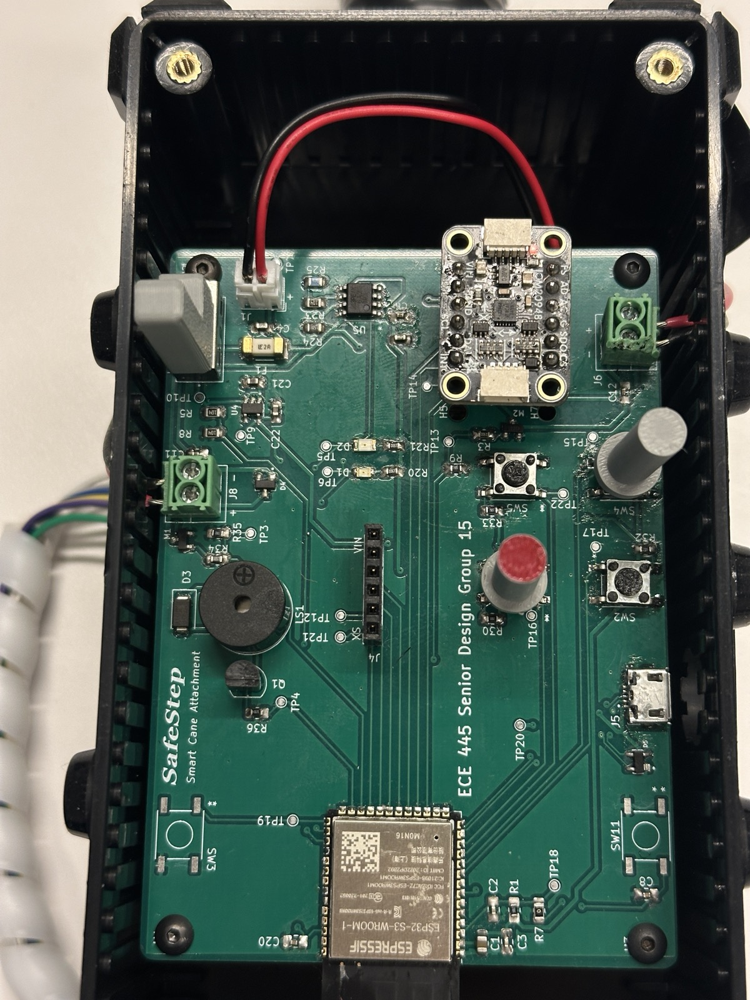
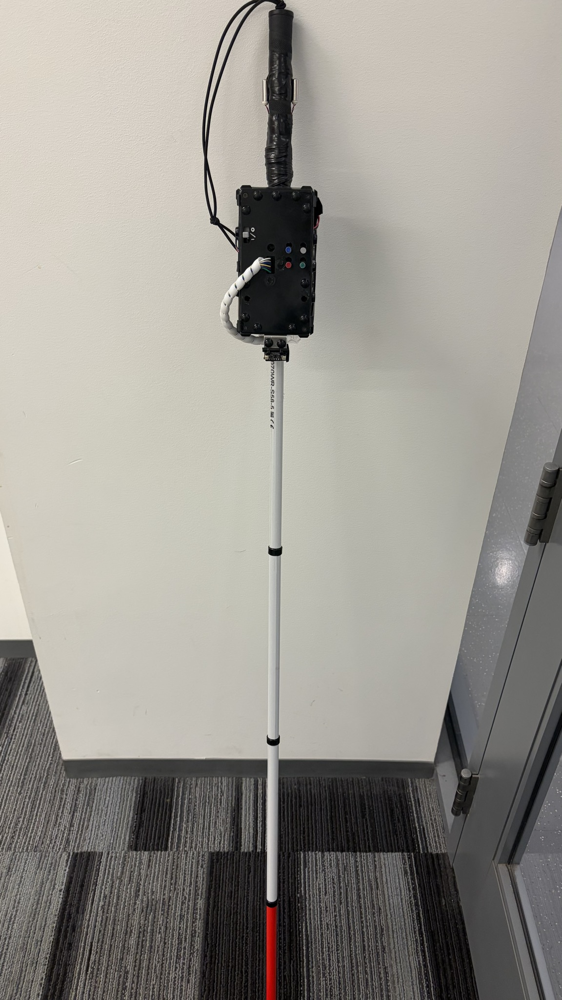
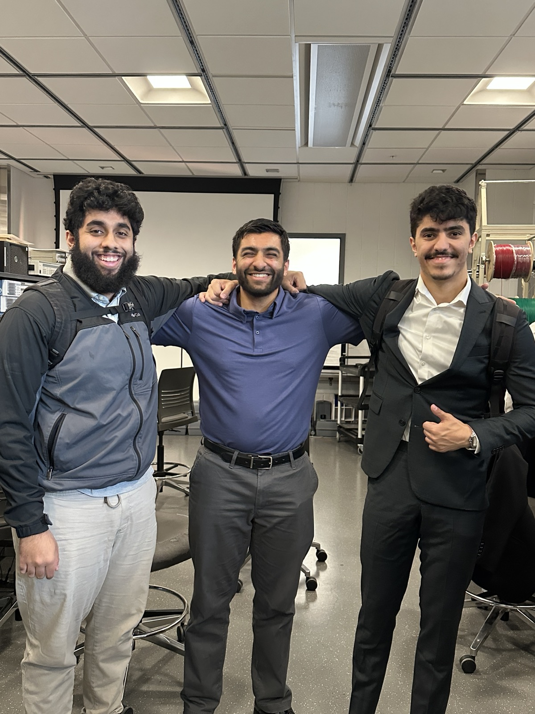

# **Eraad's Notebook**

# 2026-01-27 Project Decided
Our group spent all of today brainstorming the project we want to do for ECE 445. We came with quite a few ideas: an room air qaulity sensor and smell detector, a smart geopolitical interactive map, a smart shower system, and many other projects. Ultimately the group decided we should try to create a project that may be of use to those with disabilities. 

We decided on doing a smart white cane system with fall detection. Abdulrahman had experience in fall detection systems due to his research interests, and suggested the idea as it would nicely incorporate all our strong suits. We have not decided a name yet. 

# 2026-01-29 Proposal Submitted
Over the last few we decided the very high level parts of our project that we needed to implement. This includes the following:
- Bluetooth communication
- ESP32 Microcontroller computation
- tactile buttons and switches
- USB charging and lipo rechargable battery
- Motor Haptics 
- A distance sensor (lidar or IR TOF technology)
- IMU
- Smartphone App
- Fall detection and notification

at the moment we do not have exact specifics we do have some idea of how to go about each of these features. my strong suit will be probably doing the bluetooth communication and any other IOT related issues, since I have experience in that. Based on the group strenghts and interest, I will also take up other responsibilities.

# 2026-01-29 Proposal Submitted
Over the last few we decided the very high level parts of our project that we needed to implement. This includes the following:
- Bluetooth communication
- ESP32 Microcontroller computation
- tactile buttons and switches
- USB charging and lipo rechargable battery
- Motor Haptics 
- A distance sensor (lidar or IR TOF technology)
- IMU
- Smartphone App
- Fall detection and notification

at the moment we do not have exact specifics we do have some idea of how to go about each of these features. my strong suit will be probably doing the bluetooth communication and any other IOT related issues, since I have experience in that. Based on the group strenghts and interest, I will also take up other responsibilities.

# 2026-02-06 Allocation of Responsibilities
Based on my soldering technique, the group has decided that I will be the one in charge of assembling our pcb board. I will also be in charge of spearheading our PCB design. While my other teamates will be assisting me in this while being in charge of firware development and testing. 

We currently have delegated Arsalan in deciding the how esp32 should we wired and what it should control, including its communication with the our IMU and TOF sensor. AbdulRahman is in charge of deciding how the motors, buzzers, and peripheral components like buttons will be designed, the logic characteristics of each module, and what auxillary components are needed to make these systems run properly and safely. I will be in charge of power electronics, and I am currently doing some research on what needs to be done. 

# 2026-02-06 Allocation of Responsibilities
Based on my soldering technique, the group has decided that I will be the one in charge of assembling our pcb board. I will also be in charge of spearheading our PCB design. 

We currently have delegated Arsalan in deciding the how esp32 should we wired and what it should control, including its communication with the our IMU and TOF sensor. AbdulRahman is in charge of deciding how the motors, buzzers, and peripheral components like buttons will be designed, the logic characteristics of each module, and what auxillary components are needed to make these systems run properly and safely. I will be in charge of power electronics, and I am currently doing some research on what needs to be done. 

# 2026-02-17 Design and Practicality Discussion
Below is an image of a sketch of how we want to implement our design:

Our group heavily discussed how we envisioned our final project. 

One of the first things we discussed was the form factor of the device. We wanted the system to be an attachment rather than a full on product you would have to replace a traditional white cane with. Making it an attachment allows for less physical liability and engineering burden of designing a cane. Having an attachment allows a user to use their personal cane of their liking, without having to replace theirs for a new "smart cane". Also the user can always fall back to using the cane normally if the device seemingly malfunctions. 

Another thing we discussed is TOF sensor placement. The TOF sensor needs to be in parralel with the ground in order for the sensor to sense objects straight ahead. In the coming weeks when talking to the machine shop it should be incumbent upon us to detail how we want the sensor positioned. The TOF sensor that we decided to use VL53L4CX, since it can detect objects up to 6 meters (19.685 feet) which should be just enough for our use case. 

We also discussed the IMU sensor. The IMU sensor would need to calibrated for the orientation it is positioned at in the box. If the device exhibits unexpected behaviors from its calibrated position, we can determine a fall. We decided to use an ICM-20948 since its the more readily available IMU on the market, that fits our needed precision. 

We also discussed motors. For now we plan to use coin vibration motors and use two of them to in order to increase the haptic complexity of the device. We can give better detailed haptic feedback by using multiple motors and allows us to bias commands.

# 2026-02-25 Researching Parts
Our group is thinking about maybe using a 12V NiMH battery with a 2000 mAh rating. The battery is readily available in the supply shop for about 17 cents, which is very cheap for a battery. This saves us quite a bit of budget, but we are little concerned about its size. This battery capacity will most likely be more than enough for our project. Based on current research we were able to calculate a rough total power usage at max usage:

- ESP32-S3-WROOM microcontroller: 3.6 V × 0.5 A = 1800 mW [1]

- ICM-20948 breakout board: 3.7 V × 9.5 mA = 35.15 mW [2]

- VL53L4CX breakout board: 3.3 V × 40 mA = 132 mW [3]

- 16000 RPM vibration motors: ∼ 100 mW each =∼ 200 mW [4]

- Red LED: 100 mW [5]

- Green LED: 100 mW [6]

- Passive draw: ∼ 10 mW (very large estimation)

- Quiescent draw: ∼ 10 mW (very large estimation)

Total: 2387.15 mW

the NiMH battery we were looking at is 12 V × 2000 mAh = 24000 mWH
which means that our system can run about little under 10hours with this battery at full power usage. 

Some optimistic parts we are looking at to potentially use in our design:
-  TBP4056A Charger IC
-  AP2112K-3.3TRG1 3.3 V Regulator
-  LTST-C171KGKT Green LED
-  LTST-C150CKT Red LED
-  CEM-1203_42 Buzzer (Potentially)
-  MicroUSB 10118194-0001LF (Micro-USB-B recepticle)

# 2026-03-04 Design Review and Changes
We had our design review today and a couple of things to note: 
- We need to limit the scope of the project to more achievable requirements
- The battery had chosen may need a buck converter
- Our presentation style needs to be better (bad first impression)
- Need to talk to the machine shop asap

Based on my delegated responsibilities, I need to figure our power situation. We are thinking about going back to using the Li-Po battery. If we do this, we will need to use a specialized Li-Po battery [7], as Li-Po battery used a CC/CV charging method. 

We will use the TPB4056A as our charger IC. is it a quite common IC for smaller (<~5 Ah) Li-Po which is perfect for this project. 

Some of the specs of the TPB4056A that would be perfect for this project: 

- The TPB4056A is a single-chip charger for one-cell Li-ion or Li-poly batteries, which makes it easy to place directly on a custom PCB.
- It supports up to 1 A charging current, and that current is set with just one external resistor on the IREF pin.
- It comes in ESOP8 and DFN22-8 packages, which are practical PCB packages compared with harder-to-assemble fine-pitch parts.
- It includes built-in protections like UVLO, OVP, thermal foldback, and over-temperature protection, which reduces extra external circuitry.
- It provides PPR and CHG status pins, so your PCB can easily report power-good and charging status to an MCU or LEDs.

As of now I have done the shematic layout of device. Will try to get a wrap on our pcb design. Below is our current schematic drawing: 

# 2026-03-13 Breadboard Demo and Progress
This week was not too eventful. We had our breadboard demo. We used the an ESP32-Devboard and our IMU sensor to do fall detection. My team members created a program involving state machines to decide fall detection states. We demoed by dropping a breadboard with the connected components and using a buzzer to broadcast that a fall has been detected. So far seems to be a success but there is a lot of work still needed to be done. 

I have finished laying out and routing our PCB. We had to debug various issues such as thermal issues which were caused by improper trace widths and grounding issues which could be solved with ground stitching. After passing the DRC, we generated the Gerber, and audited the design using PCBWAY. We are expecting our PCB to arrive after spring break.

# 2026-03-28 Fourth round PCB submission
Some major updates and simplifications were made the PCB for the 4th round. We removed the USB to UART Bridge IC, and simply connected to the ESP32 data flashing pins directly to the micro-usb recepticle. I did know that ESP32-S3-WROOM-1 had D+, D- natively supported, which defeats the purpose of the MCP2200. On our last design we forgot to do differential routing, which will need to be done on this design for the D+ and D- pins. I also removed the JTAG and UART pins, as they take up unnecessary space and will hopefully not needed for the final designs. By making these changes we were able to create some space for more efficient routing. 

# 2026-04-01 Individual Progress Report 2nd Breadboard Demo
This week I finished our individual progress report. I discussed the work I have contributed to the project, and shared more insights into my responsibilities. 

We also finished designing our system for the second breadboard demo. We added our TOF sensor control and set up tresholds for distance detections. We added motors to our breadboard demo system. The mosfets we used for our PCB are SMD packages, meaning I cannot use these for our breadboard. Instead, in order to demo motor control we used a STP36NF06L, a mosfet widely used for logic control [9]. We used a regular 9 voltage battery connected to the drain to supply current the thr vibration motors. The reason we need this is becuase the motors we plan are rated for 75mA [4] and will most likely draw more than that. However, the an ESP32 can only supply 40 mA of current [1]. Therefore an external power source is used to supply the motors current, but can be logically controlled via a transistor. Based on the code our team members wrote we are able to vary the virbation motor intensity using PWM voltage variation on the ESP32 GPIO pin. This combined with out TOF sensor, we were able to create a object detection system that would give proximity feedback. 

# 2026-04-01 2nd Progress Demo preperation and current progress
This week I finished our individual progress report. I discussed the work I have contributed to the project, and shared more insights into my responsibilities. 

We also finished designing our system for the second breadboard demo. We added our TOF sensor control and set up tresholds for distance detections. We added motors to our breadboard demo system. The mosfets we used for our PCB are SMD packages, meaning I cannot use these for our breadboard. Instead, in order to demo motor control we used a STP36NF06L, a mosfet widely used for logic control [9]. We used a regular 9 voltage battery connected to the drain to supply current the thr vibration motors. The reason we need this is becuase the motors we plan are rated for 75mA [4] and will most likely draw more than that. However, the an ESP32 can only supply 40 mA of current [1]. Therefore an external power source is used to supply the motors current, but can be logically controlled via a transistor. Based on the code our team members wrote we are able to vary the virbation motor intensity using PWM voltage variation on the ESP32 GPIO pin. This combined with out TOF sensor, we were able to create a object detection system that would give proximity feedback. 

# 2026-04-07 2nd Progress Demo and Assembling our First PCB
We did our 2nd progress demo with the professor. We displayed our current progress. We presented our current breadboard based system and our our which currently is able give navigation information.

 We assembled our PCB this week, it was pretty difficult to assemble, however the easiest technique we found was to first use the stencil to fill in the solder paste, and first lay down the larger components. After the larger components have been layed down, we used the heat gun to make sure these larger components are soldered on, and also the make sure there is hardened solder on all the footprint pads for small components like capacitors and resistors. after doing so we hand soldered these components using the solder that was hardened on these pads. The final product looked like this:

 However currently we are not able to flash the ESP32 with the current program we have developed. We believe it may due to a few reasons:
 1. We did not do differential routing with the D+ and D- pins
 2. We did not connect an oscillator crystal to our MCP-2200. 
 3. Could be bad solder connections for different components like our EN reset button or BOOT button which is causing issues. 

Checking our solder connections, which seem pretty good, I believe it may be due the first two reasons which should not be an issue for the 4th round PCB, in which we corrected or deprecated those mistakes. 

# 2026-04-15 2nd Asembling our Final PCB and Machine Shop
Today we assembled and tested our final round PCB, it flashes flawlessly. We went to the machine shop last month, and they recommended to come back when we have our pcb finalized. We went to the machine shop today, and discussed what they could provide us. We specifically emphasized battery stabalization and TOF mounting orientation. We left our final pcb and cane with them. 

# 2026-04-21 Mock Demo and Work Left
The machine shop finished making our enclosure. There used hose clamps to attach the our enclosure to the cane. Enclosure size and the overall design our pretty good. However they decided to use a toggle stick to press our buttons and switch our switch, instead of dedicated attachments that can be pressed or switched outside of the enclosure. Instead We will be 3d Printing some simple button plungers and switch attachment this week. 

We have mock demo later this week. We will demonstrating what we currently have ready to our TA. We currently have fall detection, TOF object detection, and modular buttons working. Until the final demo we plan to get SMS emergency notifications working, polish the project extended motor cables so we can actually attach them to our cane handle, and add hardware add ons like cable organizer and button/switch attachements. 

# 2026-04-30 Final Demo and Final Presentation
We succesfully completed both the final demonstration and the final presentation. Overall I say both went well, and definitely showed considerable progress and growth compared to how we started. Some thing we could have focused on that would have brought our project to the next level:
- more thoughtful circuit design with more industry/production circuitry techniques that are implemented for redundancy such as hardware debouncing
- integrating our sensor ICS into our PCB
- Designing a professional and optimal enclosure 
- Reaching out to people with disabilities for input and feedback

I would say our overall project was a success, and I am very greatful for my teamates and our TA for making this project a big success. 

# 2026-05-07 Last Week for 445
Out team was picked as an honorable mention. 

# References
[1] Espressif Systems, “ESP32-S3-WROOM-1/ESP32-S3-WROOM-1U Datasheet,” [Online]. Available: https://documentation.espressif.com/esp32-s3-wroom-1wroom-1u_datasheet_en.pdf. [Accessed: Apr. 1, 2026].

[2] Adafruit Industries, “Adafruit TDK Invensense ICM-20948 9-DOF IMU,” [Online]. Available: https://cdn-learn.adafruit.com/downloads/pdf/adafruit-tdk-invensense-icm-20948-9-dof-imu.pdf. [Accessed: Apr. 1, 2026].

[3] Adafruit Industries, “Adafruit VL53L4CX Time-of-Flight Distance Sensor,” [Online]. Available: https://cdn-learn.adafruit.com/downloads/pdf/adafruit-vl53l4cx-time-of-flight-distance-sensor.pdf. [Accessed: Apr. 1, 2026].

[4] Adafruit Industries, “Vibration Motor Datasheet,” [Online]. Available: https://cdn-shop.adafruit.com/product-files/1201/P1012datasheet.pdf. [Accessed: Apr. 1, 2026].

[5] Lite-On Technology Corp., “LTST-C150CKT Datasheet,” [Online]. Available: https://optoelectronics.liteon.com/upload/download/DS-22-98-0002/LTST-C150CKT.pdf. [Accessed: Apr. 1, 2026].

[6] Lite-On Technology Corp., “LTST-C171KGKT Datasheet,” [Online]. Available: https://optoelectronics.liteon.com/upload/download/DS22-2000-118/LTST-C171KGKT.pdf. [Accessed: Apr. 1, 2026].

[7] DigiKey, “Charging Lithium-Ion and LiPo Batteries the Right Way,” [Online]. Available: https://www.digikey.com/en/maker/tutorials/2021/charging-lithium-ion-and-lipo-batteries-the-right-way. [Accessed: Apr. 1, 2026].

[8] Microchip Technology Inc., “MCP73831/2 Li-Ion/Li-Polymer Charge Management Controllers Datasheet,” [Online]. Available: https://ww1.microchip.com/downloads/en/DeviceDoc/22228A.pdf. [Accessed: Apr. 1, 2026].

[9] STMicroelectronics, “STP36NF06L Datasheet,” [Online]. Available: https://www.alldatasheet.com/html-pdf/171116/STMICROELECTRONICS/STP36NF06L/1947/1/STP36NF06L.html. [Accessed: Apr. 1, 2026].